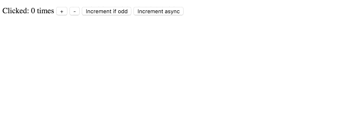

# Redux Notify
Redux middleware to notify when an action from the list is dispatched.



## Usage
Specify actions to catch, and which actions to trigger:
```js
const notifyEvents = [
  {
    catch: [INCREMENT_COUNTER, DECREMENT_COUNTER],
    dispatch: sendNotification
  }
];
```
Then just include it as a redux middleware:
```js
import notify from 'redux-notify';
const store = applyMiddleware(notify(notifyEvents))(createStore)(reducer);
```

## API
#### `notify(notifyEvents, [config])`
  - arguments
    - **notifyEvents** an *array* of *objects*:
      - **catch** - an *array* of action *objects*, which trigger dispatching of actions specified in the **dispatch** parameter.
      - **dispatch** - an *array* of action creators (*functions*) or just an action creator (*function*) to be dispatched after the actions in the **catch** parameter.
    - **config** *object* (optional)
      - **noReverse** *boolean* - prevents triggering the action back, when having cyclic dispatching.

#### Example
- [counter example](https://github.com/zalmoxisus/redux-notify/tree/master/examples/counter) - notifications examples with [react-notification-system](https://github.com/igorprado/react-notification-system) and [react-toolbox](https://github.com/react-toolbox/react-toolbox) snackbar.
- [browser-redux](https://github.com/zalmoxisus/browser-redux) - a chrome extension example, which uses `redux-notify` for messaging between content scripts and background page.
